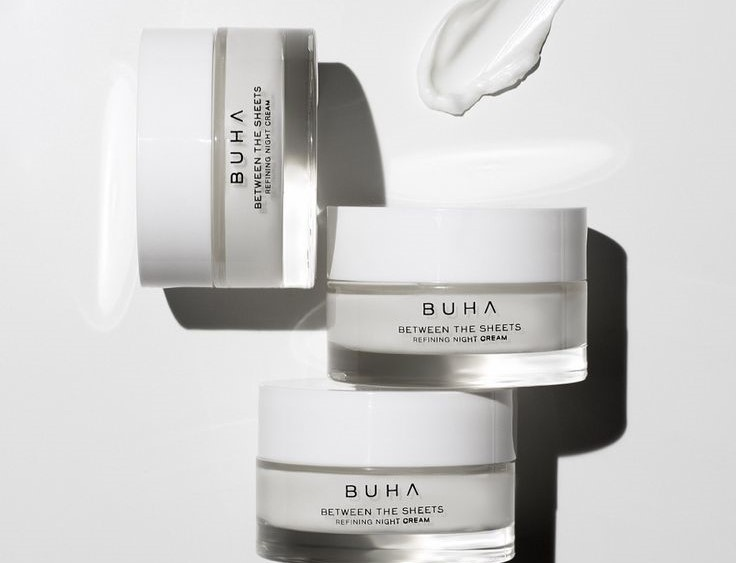

# Dermaliss

<p align="center">
  
</p>

<p align="center">
  <strong>Revive your skin, transform your life.</strong>
</p>

<p align="center">
  A front-end skincare website centred around skincare products, home remedies, facial massages, and the Dermaliss brand.
</p>

---

## ✦ Preview

<p align="center">
  
</p>

> A screenshot of the rendered website can be placed here to showcase the completed interface.

---

## About the Project

**Dermaliss** is a multi-page skincare website developed as an academic front-end web development project.

The website brings several skincare-focused sections together in one interface, allowing visitors to explore:

* 🧴 Skincare products
* 🌿 Home remedies
* 💆 Facial massage techniques
* ✦ The Dermaliss story, vision, and promise

The project focuses on visual presentation, navigation, imagery, hover interactions, animations, and consistent branding across its pages.

---

## 🌸 Website Pages

| Page         | Description                                                                                       |
| ------------ | ------------------------------------------------------------------------------------------------- |
| **Home**     | Introduces Dermaliss and provides navigation to the main sections of the website.                 |
| **Products** | Presents skincare products with their benefits, ingredients, directions, and interactive imagery. |
| **Remedies** | Presents home-skincare content using commonly used ingredients and supporting visuals.            |
| **Massages** | Introduces facial massage techniques with benefits, directions, and imagery.                      |
| **About Us** | Presents the Dermaliss story, vision, promise, and information about the project creators.        |

---

## 🧴 Products

The Products page presents five skincare products:

* **Laneige Water Sleeping Mask**
* **CeraVe Hydrating Hyaluronic Acid Serum**
* **The Ordinary Glycolic Acid 7% Toning Solution**
* **La Roche-Posay Effaclar Duo (+)**
* **Fresh Sugar Lip Treatment Advanced Therapy**

Each product includes information such as:

* Benefits
* Ingredients
* Directions
* Product imagery

The product cards use hover interactions, while the product images include a rotation effect that reveals additional information.

> The Products page functions as a **product presentation/catalogue**. This project does not implement shopping carts, checkout, payment processing, user accounts, or online ordering.

---

## 🌿 Home Remedies

The Remedies page presents skincare content based around commonly used ingredients and home treatments.

### Featured remedies

* 🍯 Honey-Coffee Face Mask
* 🍚 Rice Toner
* 🍅 Tomato Brightening Treatment
* 🥒 Cucumber Hydration Therapy
* 🍌 Gram Flour and Banana Mask

Each remedy combines written content with ingredient imagery, directions, benefits, and additional tips where applicable.

---

## 💆 Massages

The Massages page introduces several facial massage techniques:

* **Guasha Massage**
* **Roller Massage**
* **Sculpting Massage**
* **Kansa Massage**
* **Ice Globe Massage**

Each section provides information about the technique, its stated benefits, and step-by-step directions alongside supporting imagery.

The page also uses image-based navigation to help users move between the different massage sections.

---

## ✦ Interactive Design

Although **Dermaliss-Skincare-Website** is a static front-end project, interaction plays an important role in the interface.

### Smooth Navigation

The shared `scroll.js` file provides smooth navigation to specific sections of a page while accounting for the fixed navigation bar.

### Hover Effects

Hover interactions are used throughout the website for elements such as:

* Navigation buttons
* Product cards
* Product images
* Remedy imagery
* Massage selectors
* Other visual elements

### Animations

CSS animations and transitions are used for:

* Background image changes
* Fade effects
* Zoom effects
* Slide effects
* Image opacity transitions
* Hover transformations

These effects add movement to the interface while keeping the content as the main focus.

---

## 🎨 Visual Identity

Dermaliss uses a consistent skincare-oriented visual identity throughout the website.

### Colour Palette

The interface combines **deep blue tones, lighter sections, white space, and photographic imagery**.

The darker sections provide contrast against lighter content areas, while the imagery reinforces the skincare and self-care theme.

### Branding

The Dermaliss logo is used throughout the website together with a consistent navigation bar.

The primary navigation provides access to:

**HOME · PRODUCTS · REMEDIES · MASSAGES · ABOUT US**

The repeated use of colour, typography, imagery, and navigation elements helps maintain a unified identity across the different pages.

---

## 🛠 Technologies

### Core

* **HTML5** — page structure and content
* **CSS3** — styling, layouts, animations, transitions, and visual effects
* **JavaScript** — interactive behaviour and smooth section navigation

### Other Resources

* **Google Fonts** — used on the Massages page
* **Local image assets** — used for branding, products, ingredients, backgrounds, and supporting visuals

The project does not require a front-end framework or package installation.

---

## 📁 Project Structure

```text
Dermaliss-Skincare-Website/
├── About Us.html
├── home.html
├── massages.html
├── Products.html
├── remedies.html
├── scroll.js
│
├── images/
│   ├── Branding and logo assets
│   ├── Product imagery
│   ├── Remedy and ingredient imagery
│   ├── Massage imagery
│   └── Background and supporting images
│
└── Products Page/
    ├── Products.html
    ├── Products.js
    └── Product images
```

The main pages contain their page-specific styling, while `scroll.js` provides the shared smooth-scrolling navigation function.

---

## ▶ Running the Website

**Dermaliss-Skincare-Website** is a static front-end website and does not require a database, backend, build process, or package installation.

### Clone the repository

```bash
git clone https://github.com/Umaima-Manzoor/Dermaliss-Skincare-Website.git
```

### Open the project

Navigate to the cloned `Dermaliss-Skincare-Website` folder and open it in a code editor such as Visual Studio Code.

### Launch the website

Open `home.html` in a web browser.

For development, the project can also be opened using **Live Server** in Visual Studio Code.

---

## 📌 Project Scope

This repository contains the **static front-end version of Dermaliss**.

### Included

* Multi-page skincare website
* Product presentation
* Home-remedy content
* Facial massage guides
* About/brand section
* Image-based navigation
* Hover interactions
* CSS animations
* Smooth scrolling
* Consistent navigation and branding

### Not Included

* Database
* User authentication
* User accounts
* Shopping cart
* Checkout
* Payment processing
* Product ordering
* Server-side functionality

A separate Dermaliss project contains the **database implementation** and is maintained as a separate project.

---

## 🎓 Academic Project

Dermaliss was developed as an academic web-development project.

The project provided practical experience with:

* Multi-page website development
* HTML and CSS
* JavaScript interaction
* Navigation design
* Visual asset management
* CSS animations and transitions
* Consistent branding and interface design

---

<div align="center">

**Dermaliss**

*Revive your skin, transform your life.*

</div>
