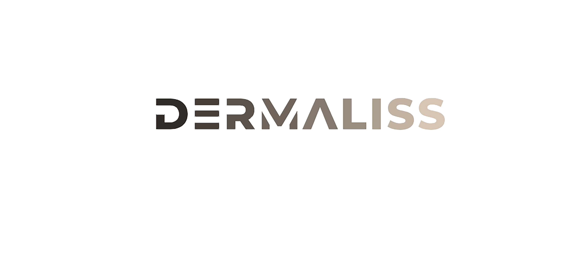
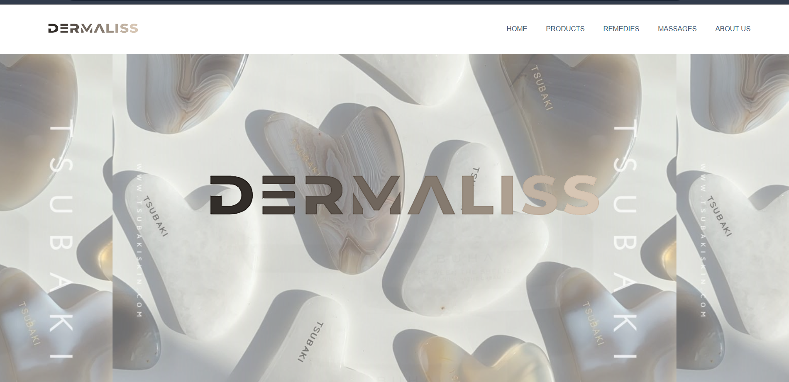
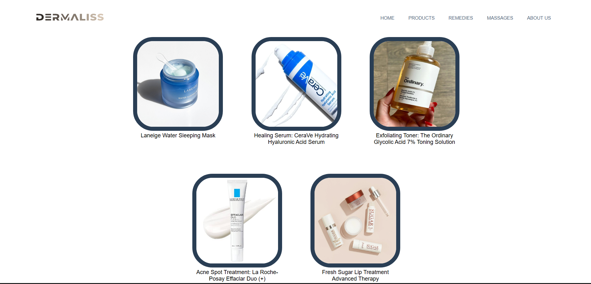
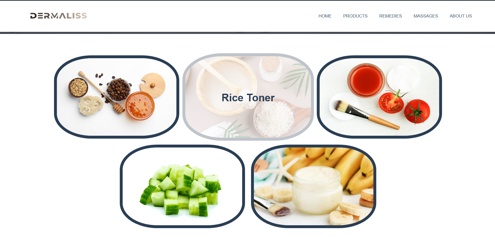
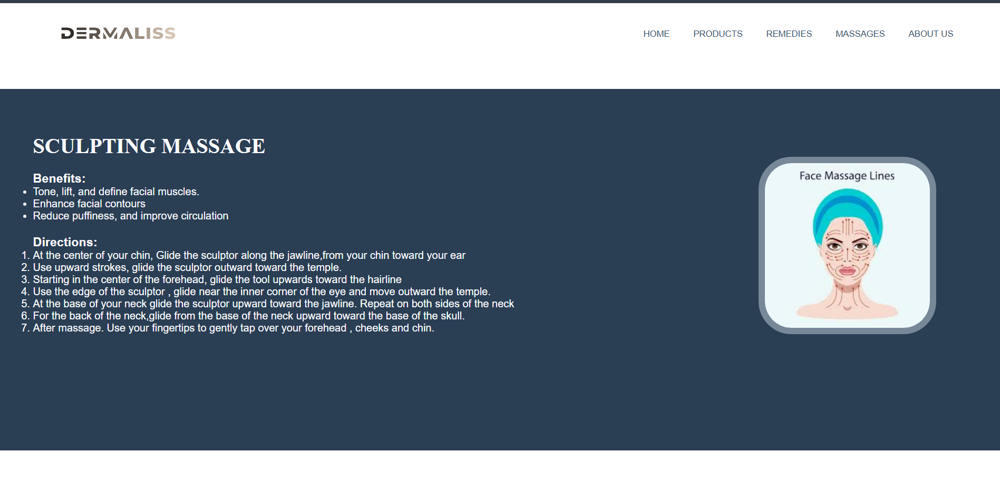
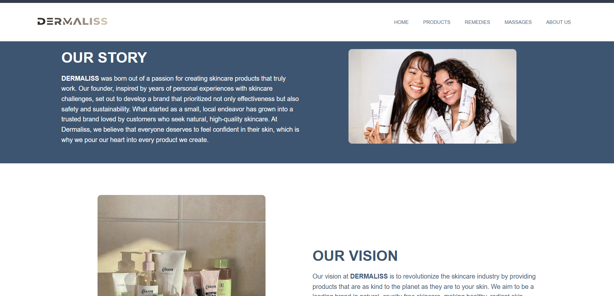
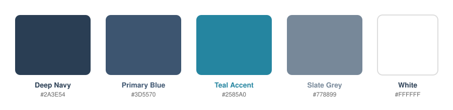

<div align="center">



<h3><em>Revive your skin, transform your life.</em></h3>

<p><strong>A multi-page skincare website built with HTML, CSS, and JavaScript.</strong></p>


<p>
  <a href="#-preview">Preview</a> ·
  <a href="#-about-dermaliss">About</a> ·
  <a href="#-team">Team</a> ·
  <a href="#-interactive-experience">Interactions</a> ·
  <a href="#-visual-identity">Design</a> ·
  <a href="#-technologies">Technologies</a> ·
  <a href="#-running-dermaliss">Run it</a>
</p>

</div>

---

## 🖼️ Preview

<table>
<tr>
<td align="center" width="50%">



<strong>Home</strong>

</td>
<td align="center" width="50%">



<strong>Products</strong>

</td>
</tr>

<tr>
<td align="center" width="50%">



<strong>Remedies</strong>

</td>
<td align="center" width="50%">



<strong>Massages</strong>

</td>
</tr>

<tr>
<td colspan="2" align="center">



<br>

<strong>About Us</strong>

</td>
</tr>
</table>

---

## 🌸 About Dermaliss

**Dermaliss** is a multi-page skincare website developed as a group academic front-end web development project.

The website brings together skincare products, home remedies, facial massage techniques, and brand information under one consistent visual identity.

Rather than functioning as a collection of unrelated HTML pages, Dermaliss was designed as a cohesive browsing experience with:

* 🧴 Product information and presentation
* 🌿 Home-remedy guides
* 💆 Facial massage techniques
* 🖼️ Image-driven content
* ✨ Hover interactions and visual effects
* 🎞️ CSS animations and transitions
* 🧭 Consistent navigation
* 🌸 A unified skincare-focused visual identity

---

## 👥 Team

Dermaliss was developed as a **group academic project** by:

* **[Umaima Manzoor](https://github.com/Umaima-Manzoor)** — Remedies page, styling contributions to the Products and Massages pages, and consistency improvements across the website.
* **[Aiman-Misbah](https://github.com/Aiman-Misbah/DSA-Project)** — Contributions to the Home and Products pages.
* **[maryam746](https://github.com/maryam746/OS-PROJECT-4TH-SEM)** — Home and Massages pages.

Work was shared across the project, with contributions also made to the shared styling, header, footer, naming conventions, and overall consistency of the website.

---

# 🌐 The Website

Dermaliss is organised into **five connected pages**, each serving a different part of the experience.

### 🏠 Home — `index.html`

The homepage introduces the Dermaliss brand and acts as the main entry point to the website.

Its hero section uses changing background imagery and visual transitions before directing visitors towards the main skincare sections:

**Products · Remedies · Massages**

---

### 🧴 Products — `pages/products.html`

The Products page presents five skincare products:

* **Laneige Water Sleeping Mask**
* **CeraVe Hydrating Hyaluronic Acid Serum**
* **The Ordinary Glycolic Acid 7% Toning Solution**
* **La Roche-Posay Effaclar Duo (+)**
* **Fresh Sugar Lip Treatment Advanced Therapy**

Each product provides information including:

**Benefits · Ingredients · Directions**

The product imagery also includes an interactive rotation effect that reveals additional information through a CSS `rotateY(180deg)` transformation.

---

### 🌿 Remedies — `pages/remedies.html`

The Remedies page focuses on ingredient-based skincare treatments.

It features:

* 🍯 **Honey-Coffee Face Mask**
* 🍚 **Rice Toner**
* 🍅 **Tomato Brightening Treatment**
* 🥒 **Cucumber Hydration Therapy**
* 🍌 **Gram Flour and Banana Mask**

Each remedy combines imagery with written information, directions, benefits, and supporting skincare guidance.

---

### 💆 Massages — `pages/massages.html`

The Massages page introduces several facial massage techniques:

* **Guasha Massage**
* **Roller Massage**
* **Sculpting Massage**
* **Kansa Massage**
* **Ice Globe Massage**

Image-based selectors allow visitors to move between the different techniques while keeping the experience visually focused.

The page also uses **Raleway** through Google Fonts for its typography.

---

### ✦ About Us — `pages/about.html`

The About Us page presents the Dermaliss brand through sections focused on:

**Our Story · Our Mission · Our Promise**

It also includes in-page navigation and project-related contact information.

---

# ✨ Interactive Experience

Although Dermaliss is a static front-end website, CSS and JavaScript are used to make the pages feel more dynamic and responsive.

### 🧭 Smooth Section Navigation

The shared `js/scroll.js` file provides smooth navigation to specific sections of the website while accounting for the fixed navigation bar.

```javascript
function navigateToSection(sectionId) {
    const section = document.getElementById(sectionId);

    if (section) {
        window.scrollTo({
            top: section.offsetTop - 90,
            behavior: 'smooth'
        });
    }
}
```

This functionality is shared across the website's pages.

---

### ✨ Hover Effects

Hover interactions provide visual feedback throughout the interface.

These include interactions on:

* Navigation elements
* Product cards
* Product imagery
* Remedy imagery
* Massage selectors
* Other interactive visual elements

---

### 🔄 Product Image Flip

The Products page uses a rotation-style interaction for its product imagery.

Clicking a product image triggers a **180-degree Y-axis rotation**, revealing additional information on the reverse side of the card.

---

### 🎞️ CSS Animations

CSS animations and transitions are used throughout the website to introduce movement without relying on complex JavaScript.

Examples include:

* Changing hero backgrounds
* Fade-in effects
* Zoom effects
* Slide effects
* Opacity transitions
* Hover transformations
* Image transitions

The animations are designed to support the visual identity rather than overwhelm the content.

---

# 🎨 Visual Identity

Dermaliss was designed around a **clean, skincare-oriented visual language** combining deep blue tones, lighter content sections, white space, photography, and product imagery.

The visual system helps the five pages feel like parts of the same brand rather than unrelated HTML documents.

### 🌌 Colour Palette

The site's visual identity is built around a collection of deep blue, lighter blue, teal, slate, and neutral tones.

<p align="center">
  
</p>

### 🌸 Branding

The Dermaliss logo is used consistently throughout the website.

The primary navigation connects:

**HOME · PRODUCTS · REMEDIES · MASSAGES · ABOUT US**

This repeated structure provides consistency as visitors move between the different sections.

<p align="center">
  
</p>

---

# 🛠️ Technologies

### HTML5

Used to structure the individual pages, sections, navigation elements, content, and images.

### CSS3

Used extensively for:

* Layout
* Responsive visual presentation
* Colours and typography
* Background imagery
* Animations
* Transitions
* Hover effects
* Image positioning
* Visual effects
* Product card transformations

### JavaScript

Used primarily for interactive behaviour, including the shared smooth-scrolling functionality and page-specific interactions.

### Google Fonts

**Raleway** is used for typography on the Massages page.

---

# 📁 Project Structure

```text
Dermaliss-Skincare-Website/
│
├── index.html
├── LICENSE
├── README.md
│
├── pages/
│   ├── about.html
│   ├── massages.html
│   ├── products.html
│   └── remedies.html
│
├── js/
│   └── scroll.js
│
├── images/
│   ├── about/
│   ├── backgrounds/
│   ├── branding/
│   ├── massages/
│   ├── products/
│   └── remedies/
│
└── screenshots/
    ├── home.png
    ├── products.png
    ├── remedies.png
    ├── massages.png
    └── about.png
```

The repository separates:

* Page files
* Shared JavaScript
* Website image assets
* Branding assets
* README presentation screenshots

This keeps the project easier to navigate and maintain.

---

# ▶️ Running Dermaliss

Dermaliss is a **static front-end website**.

No database, backend, package installation, or build process is required.

## 1. Clone the repository

```bash
git clone https://github.com/Umaima-Manzoor/Dermaliss-Skincare-Website.git
```

## 2. Open the project

Open the cloned **Dermaliss-Skincare-Website** directory in a code editor such as Visual Studio Code.

## 3. Launch the website

The main entry point is:

```text
index.html
```

You can open it directly in a browser or use a local development server.

For example:

```bash
python -m http.server 8000
```

Then open:

```text
http://localhost:8000/
```

---

# 📌 Project Scope

### Included

* Multi-page skincare website
* Brand landing page
* Product presentation
* Home-remedy content
* Facial massage guides
* About/brand sections
* Image-based navigation
* Hover interactions
* CSS animations
* Smooth scrolling
* Shared navigation
* Organised visual assets

### Not Included

* Database functionality
* User authentication
* User accounts
* Shopping cart
* Checkout
* Payment processing
* Product ordering
* Server-side functionality

> **Note:** A separate Dermaliss project contains the database implementation and is documented independently from this front-end repository.

---

# 🎓 Academic Project

Dermaliss was developed as a **group academic web-development project**.

The project provided practical experience with:

* Multi-page website development
* HTML5 structure
* CSS styling and layout
* JavaScript interaction
* Navigation design
* Asset organisation
* CSS animations and transitions
* Visual consistency
* Branding
* User-focused interface design

---

<div align="center">

<br>


### <em>Revive your skin, transform your life.</em>

<br>

**Dermaliss-Skincare-Website**

*An academic front-end web development project.*

<br>

🌸 · 🧴 · 🌿 · 💆 · ✦

</div>
